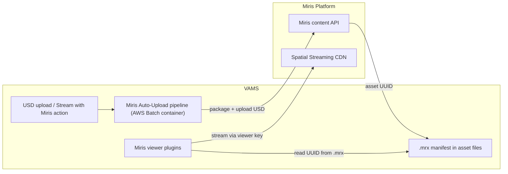

# Miris Spatial Streaming Integration

[Miris Spatial Streaming](https://miris.com) is a platform that delivers 3D geometry progressively — assets load at a lower fidelity first and sharpen to full quality within seconds, similar to video streaming but for 3D content. VAMS integrates with Miris so that USD assets can be uploaded to the Miris platform and then streamed directly inside the VAMS web viewer, without downloading the full geometry to the browser.

---

## How VAMS Integrates with Miris

The integration has two halves that work together:

- **Viewer plugins** render Miris-hosted assets in the VAMS file viewer. A `.mrx` manifest file (a small pointer to a Miris asset) triggers streaming, and USD source files can stream the same asset or start an upload.
- **The Miris Auto-Upload pipeline** uploads supported USD source assets to Miris, waits for processing, and writes the `.mrx` manifest back to the asset's file list. See the [Miris Auto-Upload Pipeline](../pipelines/miris-upload.md) for the pipeline details.

The end-to-end flow is: a USD asset is uploaded to Miris (automatically on file upload, or on demand from the viewer) → Miris processes it into a streamable asset → a `.mrx` manifest is added to the VAMS asset → the viewer streams the asset when a user opens the `.mrx` or the USD source file.

:::info
Miris integration is optional and does not affect core VAMS functionality. It cannot be enabled in GovCloud or air-gapped deployments, and it requires the `unsafe-eval` Content Security Policy directive (see [Requirements](#requirements-and-limitations)).
:::

---

## Viewer plugins

VAMS includes two Miris viewer plugins. Together they let a user stream a Miris-hosted asset by selecting either the generated `.mrx` manifest or the original USD source file.

| Plugin ID            | Extensions                        | Priority | Feature flag      | Role                                                                 |
| -------------------- | --------------------------------- | -------- | ----------------- | ------------------------------------------------------------------- |
| `miris-stream-viewer` | `.mrx`                            | 1        | `MIRIS_STREAMING` | Streams a Miris-hosted asset referenced by a `.mrx` manifest.       |
| `miris-upload-viewer` | `.usd`, `.usda`, `.usdc`, `.usdz` | 0        | `MIRIS_UPLOAD`    | Streams a USD asset already on Miris, or offers a one-click upload. |

### Stream viewer (`.mrx`)

The `miris-stream-viewer` plugin downloads the `.mrx` manifest to read the Miris asset UUID, then streams the asset using the deployment's viewer key. While Miris is still preparing an asset (typically 1–2 hours after upload), the viewer shows a "preparing" overlay and refreshes automatically when the asset becomes streamable.

### Upload / USD viewer

The `miris-upload-viewer` plugin handles USD source files. Because it has priority `0`, it is auto-selected over other USD viewers (such as the Needle USD Viewer) when `MIRIS_UPLOAD` is enabled; the viewer selector remains available to switch viewers. When a USD file is opened, the plugin fetches the asset's file list and:

- **A `.mrx` exists and streaming is configured** — streams the asset by delegating to the stream viewer, so selecting the USD file behaves the same as selecting the `.mrx`.
- **A `.mrx` exists but streaming is not configured** — shows an "Already on Miris" note.
- **No `.mrx` yet** — shows a **Stream with Miris** action that uploads the asset's root USD file to Miris.

:::note
The `.mrx` manifest is only a streaming pointer; the geometry is hosted on Miris and is never downloaded through VAMS. For this reason, the manifest download is permitted even when the asset is marked non-distributable. Per-asset access authorization still applies.
:::

---

## Configuration

Enable Miris by setting `app.miris.enabled` to `true` and providing a viewer key. To also enable the auto-upload pipeline and the upload viewer, configure `app.miris.upload`.

```json
{
    "app": {
        "webUi": {
            "allowUnsafeEvalFeatures": true
        },
        "miris": {
            "enabled": true,
            "viewerKey": "your-miris-viewer-key",
            "upload": {
                "enabled": true,
                "autoRegisterWithVAMS": true,
                "autoRegisterAutoTriggerOnFileUpload": true,
                "triggerExtensions": ".usd,.usda,.usdc,.usdz",
                "apiKeySecretArn": "arn:aws:secretsmanager:REGION:ACCOUNT:secret:miris-integration-key-XXXX",
                "mirisApiBaseUrl": "https://app.miris.com",
                "enabledDatabaseIds": ["MirisStreamableDatabase"],
                "taskTimeoutSeconds": 1800,
                "maxAssetSizeBytes": 5000000000
            }
        }
    }
}
```

| Field                                    | Required          | Description                                                                                                                |
| ---------------------------------------- | ----------------- | -------------------------------------------------------------------------------------------------------------------------- |
| `miris.enabled`                          | Yes               | Enables the Miris integration and the viewer key in `/secure-config`.                                                      |
| `miris.viewerKey`                        | Yes               | Miris viewer key used by the stream viewer for authentication. Treat as a secret; only shown once at creation in Miris.    |
| `miris.upload.enabled`                   | For upload        | Deploys the auto-upload pipeline and enables the `miris-upload-viewer` (the `MIRIS_UPLOAD` feature).                        |
| `miris.upload.apiKeySecretArn`           | For upload        | AWS Secrets Manager ARN holding the Miris Integration Key used by the upload pipeline.                                     |
| `miris.upload.enabledDatabaseIds`        | For upload        | Databases whose USD uploads auto-trigger the pipeline. The viewer's manual **Stream with Miris** action bypasses this list. |
| `miris.upload.triggerExtensions`         | For upload        | Comma-separated extensions that auto-trigger the pipeline (default `.usd,.usda,.usdc,.usdz`).                              |
| `miris.upload.mirisApiBaseUrl`           | For upload        | Miris content API base URL (default `https://app.miris.com`).                                                              |
| `miris.upload.taskTimeoutSeconds`        | For upload        | Maximum time the upload container waits for Miris processing.                                                              |
| `miris.upload.maxAssetSizeBytes`         | For upload        | Maximum source asset size accepted for upload.                                                                            |
| `webUi.allowUnsafeEvalFeatures`          | Yes               | Must be `true`; the Miris SDK requires the `unsafe-eval` CSP directive.                                                    |

Enabling these options sets the corresponding feature flags, which the frontend reads from `/api/secure-config`:

| Feature flag      | Enabled by                                            | Effect                                                                  |
| ----------------- | ----------------------------------------------------- | ----------------------------------------------------------------------- |
| `MIRIS_STREAMING` | `app.miris.viewerKey` + `allowUnsafeEvalFeatures`     | Enables the `miris-stream-viewer` plugin for `.mrx` files.              |
| `MIRIS_UPLOAD`    | `app.miris.upload.enabled` + `allowUnsafeEvalFeatures` | Enables the `miris-upload-viewer` plugin and the auto-upload pipeline.  |

For the complete configuration reference, see the [Configuration Reference](../deployment/configuration-reference.md).

---

## Architecture



The upload pipeline packages a multi-file USD root into a single `.usdz` (using OpenUSD dependency resolution) before upload, since the Miris content API accepts one self-contained file per asset. The viewer plugins stream the prepared asset directly from the Miris platform using the deployment's viewer key — VAMS never proxies or stores the streamed geometry.

---

## Requirements and limitations

- `app.miris.enabled` must be `true`, with a valid `app.miris.viewerKey`.
- `app.webUi.allowUnsafeEvalFeatures` must be `true` — the Miris SDK uses WebAssembly and requires the `unsafe-eval` CSP directive. Review this with your security team.
- The upload pipeline requires a Miris Integration Key stored in AWS Secrets Manager, referenced by `app.miris.upload.apiKeySecretArn`.
- Browser support: Chrome 90+, Firefox 88+, Safari 14+, Edge 90+, with WebGL 2.0 and WebSocket support. HTTPS is mandatory.
- After upload, Miris processes an asset (typically 1–2 hours) before it is streamable.
- Cannot be enabled in GovCloud or air-gapped deployments.

---

## Related resources

- [Miris Auto-Upload Pipeline](../pipelines/miris-upload.md) — the upload pipeline that produces `.mrx` manifests
- [File Viewers](../concepts/viewers.md) — master viewer table and extension mapping
- [Viewer Plugins Reference](../additional/viewer-plugins.md) — viewer configuration fields
- [Configuration Reference](../deployment/configuration-reference.md) — full `app.miris.*` configuration options
